# 시스템 구조

## 설계 원칙

이 시스템의 목적은 장애인권 의제가 보수·자유주의 언론의 편집 과정에서 어떻게 가시화되거나
비가시화되는지 지속적으로 추적할 수 있는 최소한의 독립적 자료 기반을 만드는 데 있다. 상업적
플랫폼의 유료 API나 개인 PC 상시 실행에 종속되지 않으면서도, 언론사 통제권과 저작권을 침해하지
않도록 공개 발견 경로·robots.txt·메타데이터만을 사용한다.

```mermaid
flowchart LR
    A["GitHub Actions 예약/수동 실행"] --> B["출처별 공식 RSS·사이트맵·목록"]
    B --> C["robots.txt 실패 폐쇄 HTTP 계층"]
    C --> D["출처 어댑터: URL·제목·날짜·공개요약"]
    D --> E["1차 규칙 판별: 제목·요약·섹션"]
    E -->|"candidate 미만"| G["메타데이터 저장"]
    E -->|"candidate 이상"| F["robots 재확인 후 본문 일시 처리"]
    F --> H["2차 규칙 판별·본문 해시"]
    H --> I["원문·HTML 즉시 폐기"]
    I --> G
    G --> J["JSONL 저장·검토 목록"]
    J --> K["KST 일일보고·4절 브리핑·health"]
    K --> L["선택적 Notion REST 발행"]
```

## 모듈 책임

- `settings.py`: 공개 연락처 검증, User-Agent와 보수적 네트워크 기본값 구성
- `http.py`: origin별 robots 캐시, 실패 폐쇄, 직렬 속도 제한, 제한시간·재시도,
  `Retry-After`, 리다이렉트 재검사
- `adapters/`: 출처별 발견 URL, RSS/XML/HTML 파싱, 본문 추출 계약
- `classifier.py`: `topics.yml` 로딩, 필드 가중치·조합·제외 문맥·임계값 계산,
  선택적 의미판별 인터페이스
- `pipeline.py`: 출처 격리, 시간창 필터, 1·2차 판별, 본문 폐기, health 집계
- `storage.py`: 멱등 JSONL upsert, review 동기화, state·health 원자적 쓰기
- `reporting.py`: 09:00 KST 반개방 구간 보고서와 출처 장애 표시
- `briefing.py`: I~IV 절 선정, 장애 칼럼 전수선별, 이슈 연결 칼럼 역검색, CRPD 매핑
- `notion_publish.py`: exact title/date 멱등 발행, 관리 표식 충돌 방지, 발행 health
- `sources.py`: 16개 출처명과 종합·노동대안·장애언론·방송 매체군 정의
- `cli.py`: collect, backfill, report, briefing, publish-notion 명령

## robots.txt와 요청 흐름

모든 origin은 첫 요청 전에 `scheme://host/robots.txt`를 같은 정직한 User-Agent로 받는다.
200 응답을 파싱할 수 있을 때만 대상 URL을 평가한다. 연결 오류, 4xx/5xx, 과도한 리다이렉트,
cross-origin robots 리다이렉트는 모두 `unavailable`이며 대상 URL을 요청하지 않는다.

기사 페이지 리다이렉트는 자동 추적하지 않는다. 각 `Location`을 절대 URL로 바꾼 뒤 새 URL의
origin별 robots를 다시 평가한다. 이로써 최초 URL만 허용되고 최종 경로가 금지된 경우의 우회를
막는다.

## 출처 어댑터

각 어댑터는 `SourceAdapter`를 구현한다.

1. `initial_discovery_urls(start, end)`가 공식 발견 경로를 반환한다.
2. `parse_discovery(content, url)`가 `ArticleDiscovery`와 검증된 동일 계열 child sitemap을 반환한다.
3. `extract_body(html, url)`가 fixture 계약과 live smoke로 검증되어야 하는 본문 영역만 임시
   텍스트로 변환한다.

파서 예외는 출처 경계 밖으로 전파되지 않는다. 발견 경로가 둘 이상이면 성공한 경로는 계속
처리하고 실패 경로는 health에 남긴다. 해당 출처의 모든 발견 경로가 실패해야 출처 실패로 본다.
모든 선택 출처가 실패한 경우에만 프로세스가 실패 코드로 종료된다.

한겨레는 최신기사 페이지를 새 페이지부터 순서대로 확인하며, 페이지에서 조사 시작시각보다 오래된
발행시각에 도달하면 이후 페이지 요청을 중단한다. `HANI_MAX_PAGES`는 구조 오류나 무한 순회를 막는
추가 상한이다.

XML 기반 매체는 공용 `XmlSyndicationAdapter` 계약을 재사용하되 출처별 모듈이 공식 URL,
허용 host와 live 검증 선택자를 독립적으로 선언한다. 더인디고는 본문 필드를 요청하지 않는
WordPress REST 어댑터를 사용한다. 참세상·MBC는 우회 경로를 두지 않는 fail-closed 어댑터이다.
JTBC는 공식 news sitemap 메타데이터만 처리하며 확인하지 않은 클라이언트 API를 추정하지 않는다.

## 판별 모델

`config/topics.yml`은 여러 주제를 담을 수 있고 현재 `disability_rights`를 기본으로 한다. 각
일치어 점수에 title 1.5, summary 1.0, section 0.6, body 1.0의 기본 필드 가중치를 곱한다.
조합 규칙은 같은 필드 안에서 필요한 단어가 모두 나타날 때 가산한다.

`장애`는 낮은 모호어 점수만 가진다. 서버·통신·시스템 장애 등 제외어가 일치하고 3점 이상의
강한 장애인 관련 표현이 없으면 최종 점수를 review 임계값 미만으로 제한한다. 강한 문맥과 제외
문맥이 함께 있으면 둘 다 기록하고 전체 점수로 판단한다. 모든 판정에는 사람이 읽을 수 있는
근거가 붙는다.

`SemanticClassifier`는 유료 의미판별기를 위한 추상 경계이다. 현재 기본
`DisabledSemanticClassifier`는 입력을 그대로 반환하며 네트워크를 사용하지 않는다. 향후
구현도 review 기사만 정제하도록 제한하고, 원문 보관 금지와 사용자 사전 승인을 지켜야 한다.

## 브리핑과 노션 발행

브리핑은 저장 메타데이터의 실제 발행시각으로 09:00 KST 반개방 구간을 다시 계산한다. I·III는
장애 판별, II는 별도 `labor_care_poverty` 규칙, IV는 오피니언 구조 판별과 선정 이슈 제목의
희소 토큰 역검색을 사용한다. 이는 본문을 다시 읽지 않는 무료 결정론적 후처리이다.

노션 발행은 data source에서 정확한 제목과 날짜를 조회한다. 같은 관리 페이지가 있으면 상위
블록 안의 `KCILNewsMonitor managed publication` 표식을 확인한 뒤에만 내용을 교체한다. 표식이
없거나 같은 후보가 복수이면 사용자 문서를 보호하기 위해 실패한다. 토큰은 secret으로만 받고
로그·health에 기록하지 않는다. Notion 연결이 없어도 수집·저장·Markdown 브리핑은 정상 작동한다.

## 저장과 멱등성

저장키 우선순위는 정규화 canonical URL, `source + article_id`,
`source + title + published_at` SHA-256이다. URL에서 fragment와 알려진 추적 파라미터를 제거하고
query를 정렬한다. 같은 기사를 다시 보면 새 행을 추가하지 않고 `last_seen_at`과 변경된 판별·
메타데이터만 갱신한다. write는 같은 디렉터리 임시파일을 만든 뒤 `os.replace`하여 원자적으로
교체한다.

`ArticleStorage` 추상 클래스와 `JsonlStorage` 구현을 분리했다. D1 등으로 이전할 때에는 다음
계약만 구현하면 파이프라인과 보고서를 유지할 수 있다.

- `upsert(ArticleRecord) -> StoreResult`
- `iter_articles() -> Iterable[ArticleRecord]`
- `contains(source, canonical_url) -> bool`

D1에서는 canonical URL 해시를 primary key로, `published_at`, `source`, `classification`을
index로 두고 기존 JSONL을 순차 import한다. import 전후 출처별·날짜별 건수와 key checksum을
대조하고, 완전 전환 전에는 JSONL을 읽기 전용 보존본으로 유지한다.

## 시간과 실행 복구

내부 값은 모두 UTC timezone-aware datetime이며 구간은 `[start, end)`이다. 보고만
Asia/Seoul로 변환한다. 3시간 수집이 최근 6시간을 겹쳐 보고 일일 백필이 48시간을 다시 확인하므로,
예약 지연·한 차례 누락·발행시각 수정은 다음 실행에서 회복될 수 있다.
